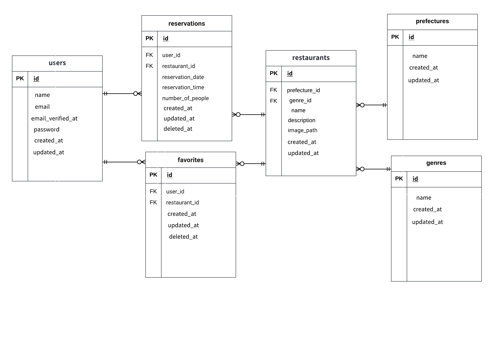

# restaurant-reservation-service
# 飲食店予約システム
Reseは飲食店の予約システムです。ログイン後、店舗の予約やお気に入りを追加できます。</br>

## 作成した目的
実践に近い開発経験をつむため作成しました。
## アプリケーションURL
作成中です。
## 機能一覧
会員登録機能、ログイン機能、お気に入り追加/削除、予約追加/変更/削除、飲食店検索機能</br>
## 使用技術(実行環境)
- docker
- PHP 8.x
- Laravel 8.x
- MySQL 8.x
- laravel-fortify
## テーブル設計
 (1).png>)
## ER図

## 環境構築
**Dockerビルド**
1. `git clone https://github.com/ymym918/restaurant-reservation-service`
2. DockerDesktopアプリを立ち上げる
3. `docker-compose up -d --build`

> *MacのM1・M2チップのPCの場合、`no matching manifest for linux/arm64/v8 in the manifest list entries`のメッセージが表示されビルドができないことがあります。
エラーが発生する場合は、docker-compose.ymlファイルの「mysql」内に「platform」の項目を追加で記載してください*
``` bash
mysql:
    platform: linux/x86_64(この文追加)
    image: mysql:8.0.26
    environment:
```
**Laravel環境構築**
1. `docker-compose exec php bash`
2. `composer install`
3. 「.env.example」ファイルを 「.env」ファイルに命名を変更。または、新しく.envファイルを作成
4. .envに以下の環境変数を追加
``` text
DB_CONNECTION=mysql
DB_HOST=mysql
DB_PORT=3306
DB_DATABASE=laravel_db
DB_USERNAME=laravel_user
DB_PASSWORD=laravel_pass
```
5. アプリケーションキーの作成
``` bash
php artisan key:generate
```

6. マイグレーションの実行
``` bash
php artisan migrate
```

7. シーディングの実行
``` bash
php artisan db:seed
```
## ダミーデータについて
**動作確認時にテストユーザーをご利用ください**
- email: test@example.com
- password :00000000

## URL
- 開発環境　　：http://localhost/
- phpMyAdmin：http://localhost:8080/